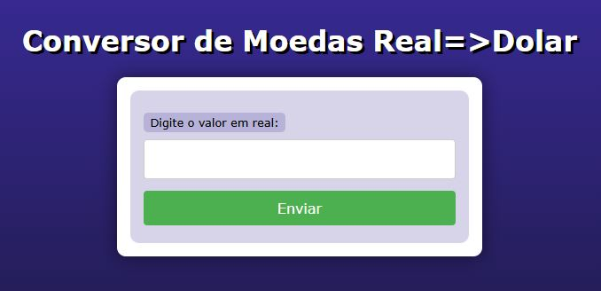
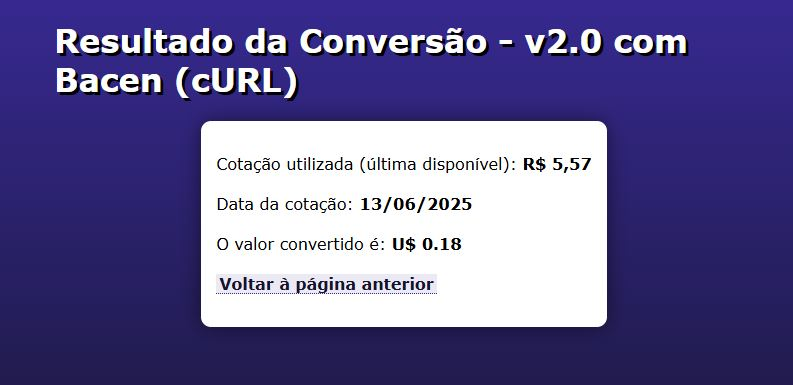

# 💱 Conversor de Moedas - Real para Dólar (v2.0)

Este é um projeto desenvolvido em PHP que realiza a conversão de valores em reais para dólares com base na **cotação oficial do Banco Central do Brasil (BACEN)**, utilizando a API pública PTAX via cURL.

---

## 📸 Imagens do Projeto

### 🔹 Tela Inicial


### 🔹 Resultado da Cotação


---

## ⚙️ Funcionalidades

- Entrada de valor em reais via formulário;
- Validação do número informado;
- Consulta da cotação oficial do dólar via API da PTAX (BACEN);
- Conversão automática e exibição do valor em dólares;
- Caso a cotação do dia não esteja disponível (feriado ou fim de semana), busca dos dias anteriores;
- Estilo limpo e moderno com HTML5 + CSS3.

---

## 🧪 Tecnologias utilizadas

- PHP 8.4 (modo embutido ou via XAMPP)
- HTML5
- CSS3
- API oficial [BACEN PTAX](https://olinda.bcb.gov.br/olinda/servico/PTAX/versao/v1/odata/)

---

## 🚀 Como rodar localmente

1. Instale o PHP 8 ou XAMPP no seu computador.
2. Clone este repositório:
   ```bash
   git clone https://github.com/dmm76/cotacaodolar.git
